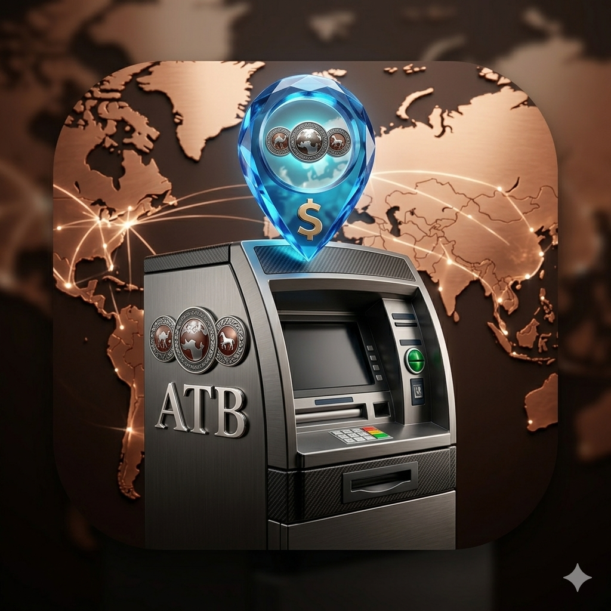
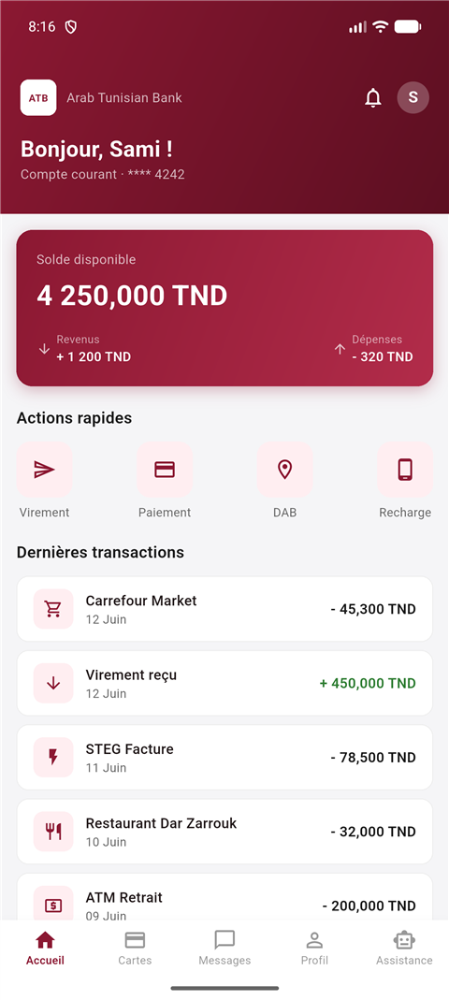
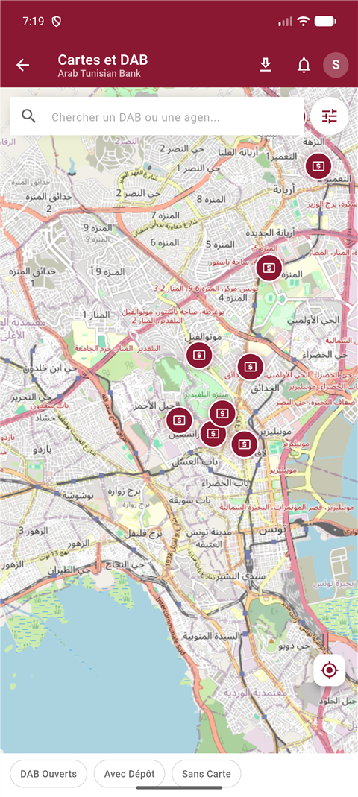
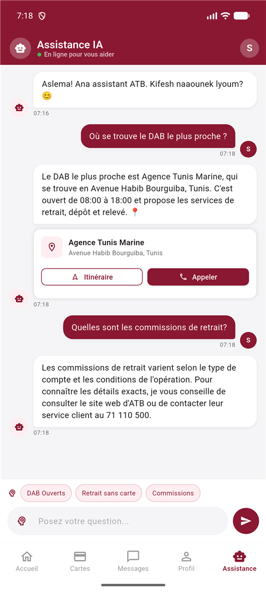
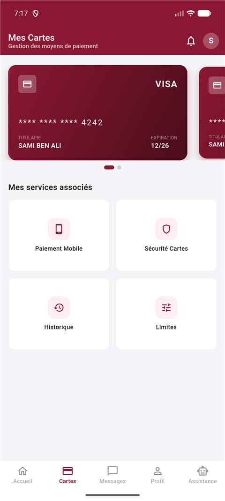
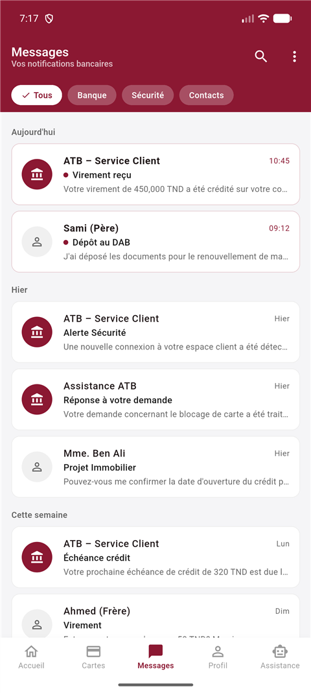
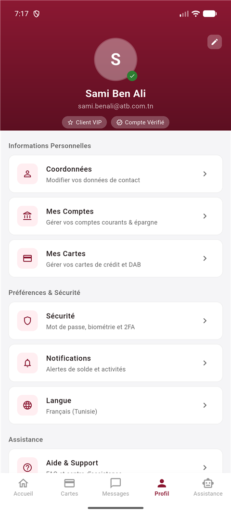
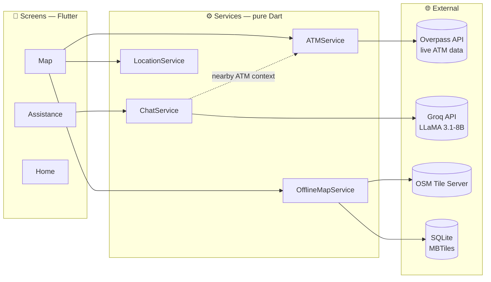

<div align="center">

<!-- HEADER -->


# 🏦 ATB Mobile — Arab Tunisian Bank

### *The most complete open-source mobile banking experience built for Tunisia*

<br/>

[](https://github.com/1hamzaachour-ai/ATB-ATM-LOCATOR-/actions/workflows/ci.yml)
[](https://flutter.dev)
[](https://dart.dev)
[](LICENSE)
[](https://flutter.dev)
[](https://groq.com)
[](https://openstreetmap.org)

<br/>

> **"The banking app Tunisia deserves — fast, intelligent, and built with love."**

<br/>

[💼 Business Context](#-business-context) • [✨ Features](#-features) • [📱 Screenshots](#-screenshots) • [🤖 AI Assistant](#-ai-assistant--derja) • [📦 Installation](#-installation) • [🏗️ Architecture](#-architecture) • [🧪 Quality](#-quality--testing) • [🤝 Contributing](#-contributing)

---

</div>

## 🌟 What is ATB Mobile?

ATB Mobile is a **full-featured Flutter banking application** built from scratch for Arab Tunisian Bank customers. It combines real-time ATM geolocation, an AI-powered assistant that speaks **Tunisian dialect (Derja)**, and a sleek card management system — all wrapped in ATB's iconic burgundy brand identity.

This isn't a prototype. This isn't a demo. This is a **production-ready** mobile banking experience with offline support, live data from OpenStreetMap, and AI responses under 500ms.

---

## 💼 Business Context

**The problem.** Finding a working ATM in Tunisia that offers the *right* service — cash deposit, cardless withdrawal, 24/7 access — is a daily friction point. Bank websites list branches, not live ATM capabilities. The result: customers call the support line for questions a map could answer, and call centers absorb the cost.

**The solution.** ATB Mobile turns that support burden into self-service:

| Business pain | How the app answers it |
|---------------|------------------------|
| 📞 Call center flooded with "where is the nearest ATM?" | Live geolocated map with service filters (open now, deposit, cardless) |
| 🌐 Customers who write in Derja, French or English | AI assistant that mirrors the user's language — including Tunisian dialect |
| 📶 Unreliable mobile coverage outside big cities | Offline map regions (MBTiles) that work with zero connectivity |
| 💸 Licensing costs of Google Maps / proprietary AI | OpenStreetMap + Groq free tier — **zero recurring API cost** |

**Measurable value:** every ATM lookup handled in-app is a call that never reaches the 71 110 500 hotline, and every Derja conversation handled by the assistant widens the bank's reach to customers who would never use a French-only tool.

---

## ✨ Features

<table>
<tr>
<td width="50%">

### 🗺️ Live ATM Map
- Real-time ATM locations fetched from **OpenStreetMap Overpass API**
- Color-coded markers: 🔴 Open · ⚫ Closed · 🟡 Selected
- GPS user location with animated blue dot
- Smart filters: **Open Now · Deposit · Cardless Withdrawal**
- One-tap Google Maps navigation
- 20+ pre-loaded Tunisian ATMs as instant fallback

</td>
<td width="50%">

### 🤖 AI Assistant · Derja
- Powered by **Groq LLaMA 3.1-8B** — responses in **< 500ms**
- Natively speaks **Tunisian Arabic (Darija)**, French & English
- Seamlessly handles code-switching mid-sentence
- Knows ATB services, fees, card blocking procedures
- Context-aware: loads your nearby ATMs for personalized answers
- Animated typing indicator with bouncing dots

</td>
</tr>
<tr>
<td width="50%">

### 💳 Card Management
- Beautiful card carousel with **VISA / Mastercard** support
- Instant card freeze & security controls
- Daily withdrawal limit management
- Full transaction history
- Mobile payment & QR code support

</td>
<td width="50%">

### 📱 Offline Maps
- Download entire city regions as **MBTiles** (SQLite)
- Resume interrupted downloads — tile-level checkpoint
- Works with **zero internet connection**
- Visual progress bar with tile count & estimated size
- Manage downloaded regions (view size, delete)

</td>
</tr>
<tr>
<td width="50%">

### 🔔 Notifications & Messages
- Grouped by date (Today · Yesterday · This Week)
- Filter tabs: **All · Bank · Security · Contacts**
- Transaction alerts, fraud warnings, system messages

</td>
<td width="50%">

### 👤 Profile & Settings
- Expandable SliverAppBar with VIP customer badge
- Quick account overview
- Settings sections: Security · Notifications · Language

</td>
</tr>
</table>

---

## 📱 Screenshots

<div align="center">

| Home | Live ATM Map | AI Assistant |
|:---:|:---:|:---:|
|  |  |  |

| Card Management | Notifications | Profile |
|:---:|:---:|:---:|
|  |  |  |

</div>

---

## 🗺️ Live ATM Map

The map screen is the crown jewel of ATB Mobile. It pulls real ATM data from the **OpenStreetMap Overpass API** covering the entire Tunisia bounding box, calculates distances from your GPS position, and renders everything on a smooth `flutter_map` canvas.

```
User opens map
     │
     ├─ GPS location requested (with graceful permission handling)
     ├─ Overpass API queried for ATMs in Tunisia (15s timeout)
     │       └─ Fallback: 20 hardcoded ATMs if API unreachable
     ├─ Distances calculated and list sorted by proximity
     └─ Map animates to user position at zoom 13
```

**Filter system** — three independent toggles that chain together:
```dart
// Filters compose elegantly — no redundant state
List<ATM> get _filtered => _atms
  .where((a) => !_filterOpen     || a.isOpen)
  .where((a) => !_filterDeposit  || a.hasDeposit)
  .where((a) => !_filterCardless || a.hasCardless)
  .where((a) => _search.isEmpty  || a.matchesQuery(_search))
  .toList();
```

---

## 🤖 AI Assistant — Derja

The chatbot doesn't just speak Arabic. It speaks **Tunisian**. There's a difference.

```
User: "feen el dab el akreb m3a service dépôt?"

ATB AI: 'Barra! "Agence Tunis Marine" 320m men andek
         3andha module dépôt. Maftouha 08h-18h. 📍
         Tħeb l'itinéraire?'
```

The system prompt engineers a **trilingual banking persona** that:
- Mirrors the user's language instantly
- Uses authentic local phrasing (*mrigel*, *famma*, *kifech*, *barra*)
- Never responds in Modern Standard Arabic (Fusha) unless asked
- Keeps answers under 4 sentences — no fluff

**API flow:**
```
User message
    │
    ├─ Last 10 messages injected as conversation history
    ├─ Top 5 nearby ATMs appended to system prompt
    ├─ POST → https://api.groq.com/openai/v1/chat/completions
    │         model: llama-3.1-8b-instant
    │         max_tokens: 512 · temperature: 0.7
    └─ Response rendered in < 500ms
```

---

## 📦 Installation

### Prerequisites
- Flutter 3.44+ ([install guide](https://docs.flutter.dev/get-started/install))
- Android Studio or VS Code
- An Android or iOS device / emulator
- A free [Groq API key](https://console.groq.com)

### 1. Clone the repository
```bash
git clone https://github.com/1hamzaachour-ai/ATB-ATM-LOCATOR-.git
cd ATB-ATM-LOCATOR-
```

### 2. Set up your API key
```bash
# Copy the example secrets file
cp lib/config/secrets.example.dart lib/config/secrets.dart
```

Then edit `lib/config/secrets.dart`:
```dart
const String groqApiKey = 'your_groq_api_key_here';
```

> 🔐 `secrets.dart` is gitignored — your key will never be accidentally committed.

### 3. Install dependencies
```bash
flutter pub get
```

### 4. Run the app
```bash
# List connected devices
flutter devices

# Run on your device
flutter run

# Build release APK
flutter build apk --release
```

### 5. Run the tests
```bash
flutter test
```
Unit tests cover the Overpass API parser (`ATM.fromOverpass`), distance formatting, and the offline-map tile mathematics.

---

## 🏗️ Architecture

### High-level data flow



### Repository layout

```
atb_banking_app/
│
├── lib/                          # Application source code
│   ├── config/
│   │   ├── secrets.dart          # 🔐 gitignored — your API keys
│   │   └── secrets.example.dart  # template for contributors
│   │
│   ├── models/                   # Domain entities (pure Dart, no UI)
│   │   ├── atm.dart              # ATM model + Overpass API parser
│   │   └── chat_message.dart     # Chat message with optional ATM card
│   │
│   ├── services/                 # Business logic & external integrations
│   │   ├── atm_service.dart      # Overpass API + 20 fallback ATMs
│   │   ├── chat_service.dart     # Groq LLaMA integration
│   │   ├── location_service.dart # GPS + permission handling
│   │   ├── offline_map_service.dart  # MBTiles download & management
│   │   └── mbtiles_tile_provider.dart # SQLite → flutter_map bridge
│   │
│   ├── screens/                  # UI, one folder per feature
│   │   ├── home/                 # Balance card + quick actions
│   │   ├── map/                  # Live ATM map + offline download
│   │   ├── cartes/               # Card carousel + services
│   │   ├── messages/             # Notifications center
│   │   ├── profil/               # User profile + settings
│   │   ├── assistance/           # AI chatbot screen
│   │   └── atm_detail/           # ATM detail + mini map
│   │
│   ├── theme.dart                # ATB brand colors & typography
│   └── main.dart                 # App entry point
│
├── test/                         # Unit tests (models & services)
│   ├── models/atm_test.dart
│   └── services/offline_region_test.dart
│
├── docs/                         # Project documentation & pitch material
│   └── presentation/             # Slide decks (HTML, PPTX) + assets
│
├── scripts/                      # Developer tooling
│   ├── make_pptx.py              # Presentation generator
│   └── update.bat                # One-click commit & push helper
│
├── assets/                       # App icon & static resources
│
└── android/
    └── app/src/main/
        └── AndroidManifest.xml   # INTERNET + LOCATION permissions
```

**Layering rule:** `screens → services → models`. UI never talks to an API directly, and models stay pure Dart — which is what makes them unit-testable.

---

## 🧪 Quality & Testing

Every push and pull request runs the full quality gate on **GitHub Actions** ([ci.yml](.github/workflows/ci.yml)):

| Check | Command | Status |
|-------|---------|--------|
| Static analysis | `flutter analyze` | ✅ 0 issues |
| Unit tests | `flutter test` | ✅ 10/10 passing |

Tests target the pure business logic, with no UI mocking required:

- **Overpass API parser** (`ATM.fromOverpass`) — fully-tagged nodes *and* graceful fallbacks when OSM tags are missing
- **Distance formatting** — meters, kilometers, and unknown-distance edge cases
- **Offline tile mathematics** — slippy-map tile counting verified against known world-tile counts, bounding-box sanity for all predefined regions

---

## 🛠️ Tech Stack

| Layer | Technology | Why |
|-------|-----------|-----|
| **Framework** | Flutter 3.44 | Single codebase for Android & iOS |
| **Maps** | flutter_map + OpenStreetMap | Free, no API key, full control |
| **AI** | Groq API + LLaMA 3.1-8B | Free tier, fastest inference available |
| **ATM Data** | Overpass API | Real OSM data for all of Tunisia |
| **Offline Maps** | MBTiles (SQLite) | Single file per region, resumable |
| **GPS** | geolocator | Permission handling + distance calc |
| **HTTP** | http + Dio | REST calls + chunked tile download |
| **Storage** | sqflite + path_provider | Local tile database |
| **Navigation** | url_launcher | Google Maps deep link |

---

## 🎨 Design System

The entire app follows ATB's official brand identity:

```dart
// ATB Brand Colors
static const Color primary     = Color(0xFF8B1832); // ATB Crimson
static const Color primaryDark = Color(0xFF5C0F21); // Deep Burgundy
static const Color primaryLight= Color(0xFFB22C4A); // Rose Crimson
static const Color green       = Color(0xFF2E7D32); // Success / Open
static const Color chipBg      = Color(0xFFFEF0F2); // Tinted Background
```

- **Typography:** System default with `w500`–`w800` weight range
- **Cards:** 12–16px border radius, subtle `Colors.black12` shadows
- **Bottom Navigation:** `IndexedStack` for instant tab switching (no rebuilds)

---

## 🌍 Offline Map Coverage

Pre-configured regions ready to download:

| Region | Zoom Levels | Est. Size | Tiles |
|--------|------------|-----------|-------|
| Grand Tunis | 10–15 | ~90 MB | ~6,000 |
| Sfax | 10–15 | ~45 MB | ~3,000 |
| All Tunisia | 5–11 | ~80 MB | ~5,000 |

Downloaded maps are stored as **MBTiles** files in the app's private document directory — no external storage permissions needed.

---

## 📋 Roadmap

- [x] Live ATM map with Overpass API
- [x] AI chatbot in Tunisian Darija
- [x] Card management screen
- [x] Offline map download (MBTiles)
- [x] Custom ATB app icon
- [ ] Biometric authentication
- [ ] Real ATB backend API integration
- [ ] Push notifications
- [ ] App Store / Play Store release
- [ ] Dark mode

---

## 🤝 Contributing

Contributions are welcome! Here's how to get started:

1. **Fork** the repository
2. Create your feature branch: `git checkout -b feature/amazing-feature`
3. Copy `secrets.example.dart` → `secrets.dart` and add your Groq key
4. Commit your changes: `git commit -m 'Add amazing feature'`
5. Push to the branch: `git push origin feature/amazing-feature`
6. Open a **Pull Request**

---

## 📄 License

This project is licensed under the MIT License — see the [LICENSE](LICENSE) file for details.

---

<div align="center">

## 👨‍💻 Author

**Hamza Achour**

[](mailto:1hamza.achour@gmail.com)
[](https://github.com/1hamzaachour-ai)

<br/>

---

<sub>Built with ❤️ in Tunisia 🇹🇳 · Powered by Flutter & Groq AI</sub>

<br/>

**⭐ Star this repo if it impressed you!**

</div>
